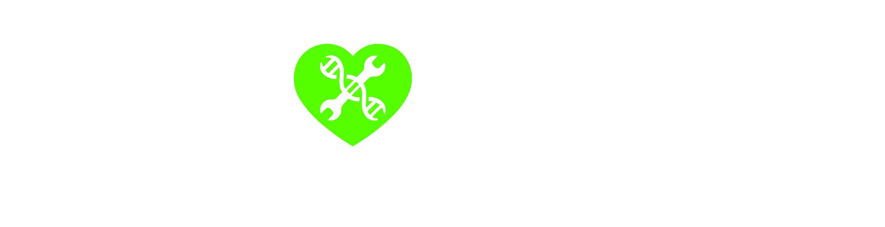

# The #WeHeartHackers initiative
### **#WeHeartHackers connects independent security researchers with industry, to collaborate, assess, and address potential issues that could cause harm to human life, public safety, and public trust.**

Developed by industry and the security research community with support from federal government partners, the **#WeHeartHackers** initiative acts as a public private partnership that accelerates security maturity across and within critical infrastructure sectors.

In 2019, **#WeHeartHackers** saw 10 medical device makers pledge high-trust collaboration with the security researcher community. These industry partners provided security researchers with more than 30 medical devices, learning adversary tactics and improved security approaches. Among other output, research from this event contributed to [FDA](https://www.fda.gov/medical-devices/safety-communications/urgent11-cybersecurity-vulnerabilities-widely-used-third-party-software-component-may-introduce) and [DHS](https://www.us-cert.gov/ics/advisories/icsa-19-274-01) communications about critical infrastructure, coordinated first with the affected companies.

The **#WeHeartHackers** initiative is expanding to other sectors in 2020 with the help of DHS, sector specific agencies, such as the FDA, industry partners and other security researcher-led non-profit organizations to galvanize support from critical infrastructure manufacturers. We welcome those who support good faith cybersecurity research to ensure we are ***safer, sooner, together.***

<a href="https://twitter.com/intent/tweet?button_hashtag=wehearthackers&ref_src=twsrc%5Etfw" class="twitter-hashtag-button" data-show-count="false">Tweet #WeHeartHackers</a>

<a href="https://airtable.com/shrEmhFBqJ1BUjmZR" class="btn">Join #WeHeartHackers</a>


